# Fluxos de Comunicação - Microfront-end Architecture

## 📋 Visão Geral

Este documento detalha os fluxos de comunicação entre os microfront-ends do PaipFood, incluindo diagramas de sequência, fluxos de eventos e padrões de interação via Event Bus.

## 🌊 Fluxos Principais

### 1. Fluxo de Pedido Completo (Consumer App)

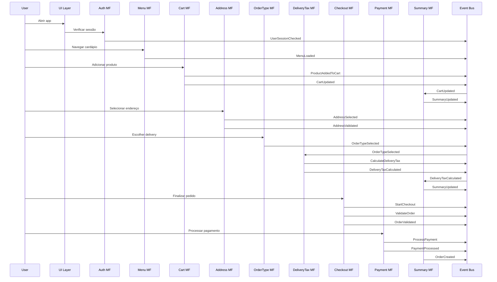

### 2. Fluxo de Cálculo de Taxa de Entrega

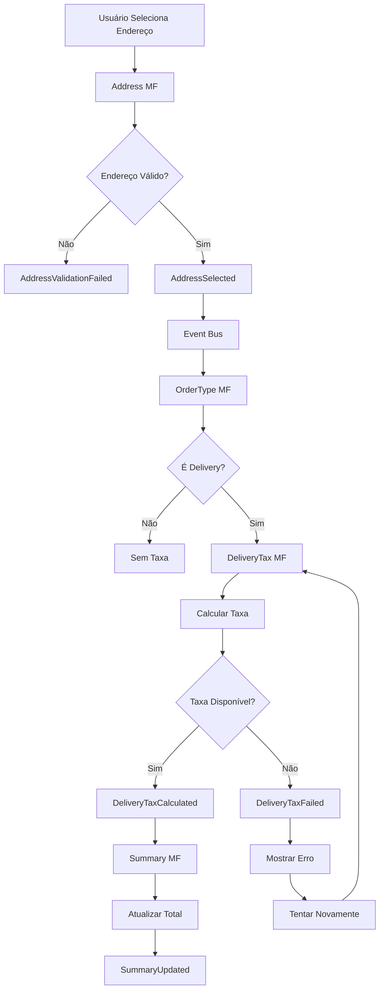

### 3. Fluxo de Autenticação

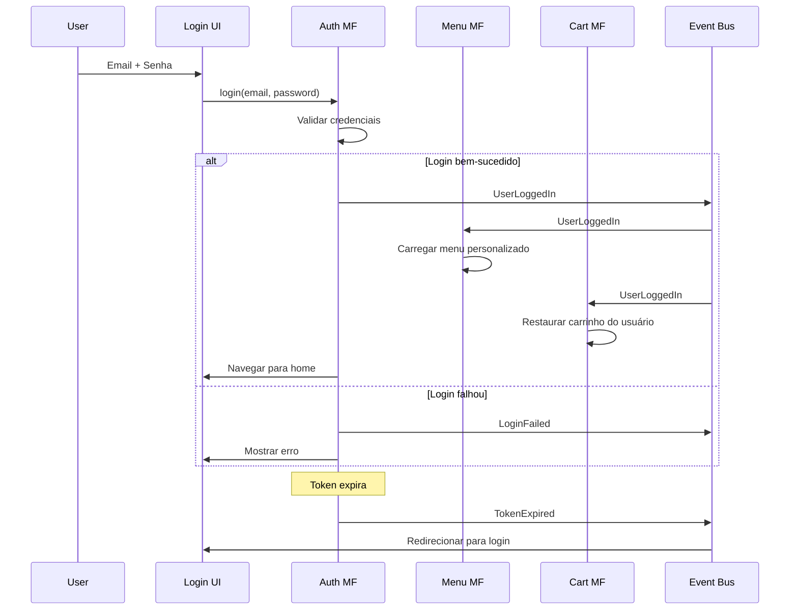

### 4. Fluxo de Carrinho de Compras

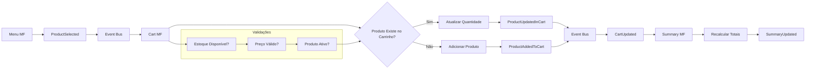

### 5. Fluxo de Checkout

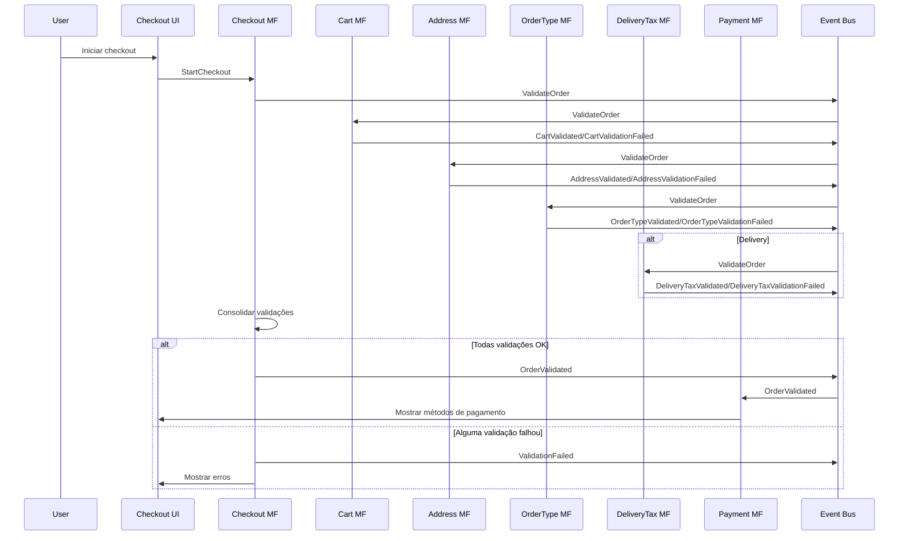

## 🔄 Padrões de Comunicação

### Event-Driven Architecture

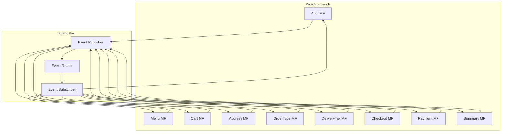

### Command Query Responsibility Segregation (CQRS)

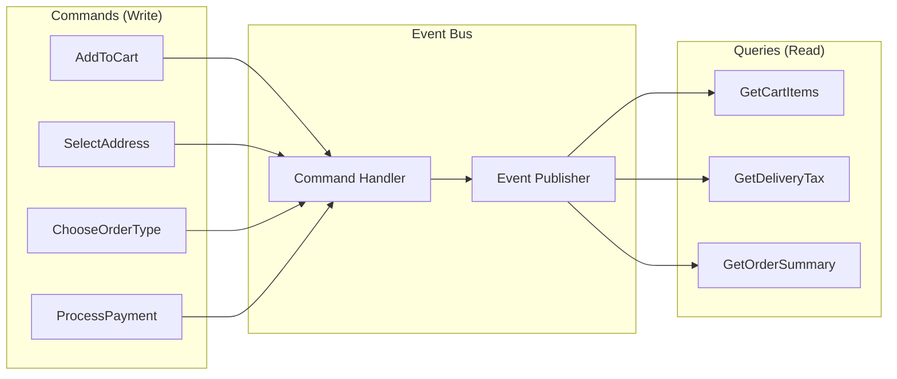

## 📱 Fluxos por Aplicação

### Consumer App Flow

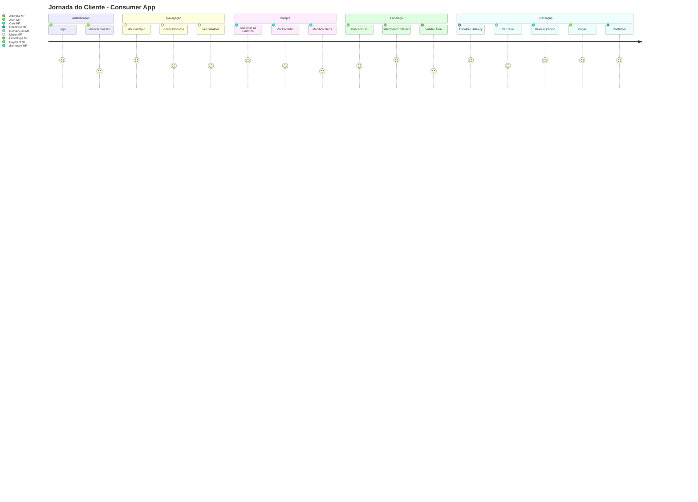

### Manager App Flow

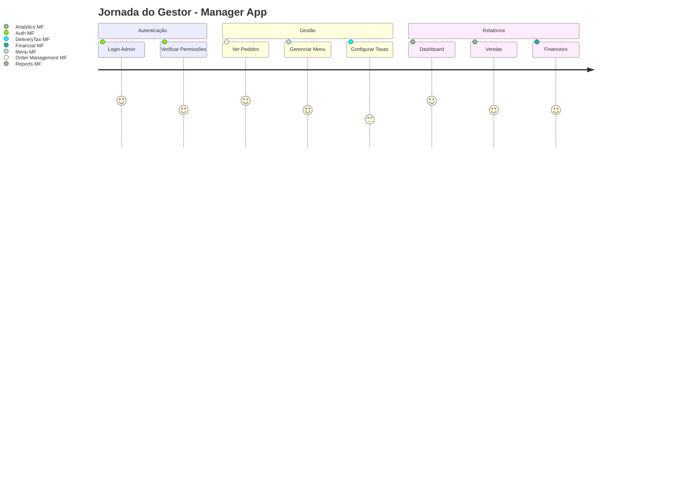

### Portal Flow

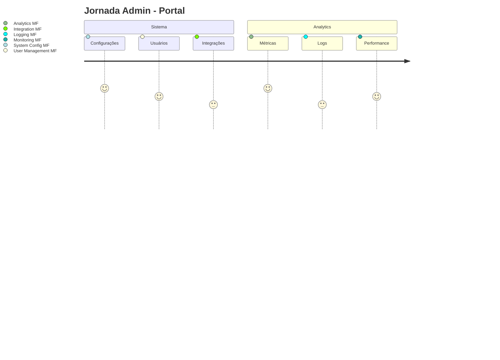

## 🎯 Event Mapping

### Eventos por Microfront-end

| Microfront-end | Eventos Emitidos | Eventos Consumidos |
|----------------|------------------|-------------------|
| **Auth** | `UserLoggedIn`, `UserLoggedOut`, `TokenExpired` | `RequireAuthentication`, `RefreshToken` |
| **Menu** | `ProductSelected`, `MenuLoaded`, `CategoryChanged` | `LoadMenu`, `FilterProducts`, `UserLoggedIn` |
| **Cart** | `ProductAddedToCart`, `CartUpdated`, `CartCleared` | `AddToCart`, `RemoveFromCart`, `UserLoggedIn` |
| **Address** | `AddressSelected`, `AddressValidated`, `OutOfDeliveryArea` | `SearchAddress`, `ValidateAddress` |
| **OrderType** | `OrderTypeSelected`, `DeliveryRequired` | `SelectOrderType`, `ValidateOrderType` |
| **DeliveryTax** | `DeliveryTaxCalculated`, `DeliveryTaxFailed` | `CalculateDeliveryTax`, `AddressSelected`, `OrderTypeSelected` |
| **Checkout** | `OrderValidated`, `OrderCreated`, `ValidationFailed` | `StartCheckout`, `ValidateOrder` |
| **Payment** | `PaymentProcessed`, `PaymentFailed`, `PaymentMethodSelected` | `ProcessPayment`, `ValidatePayment` |
| **Summary** | `SummaryUpdated`, `TotalsCalculated` | `CartUpdated`, `DeliveryTaxCalculated`, `PaymentMethodSelected` |

### Event Flow Matrix

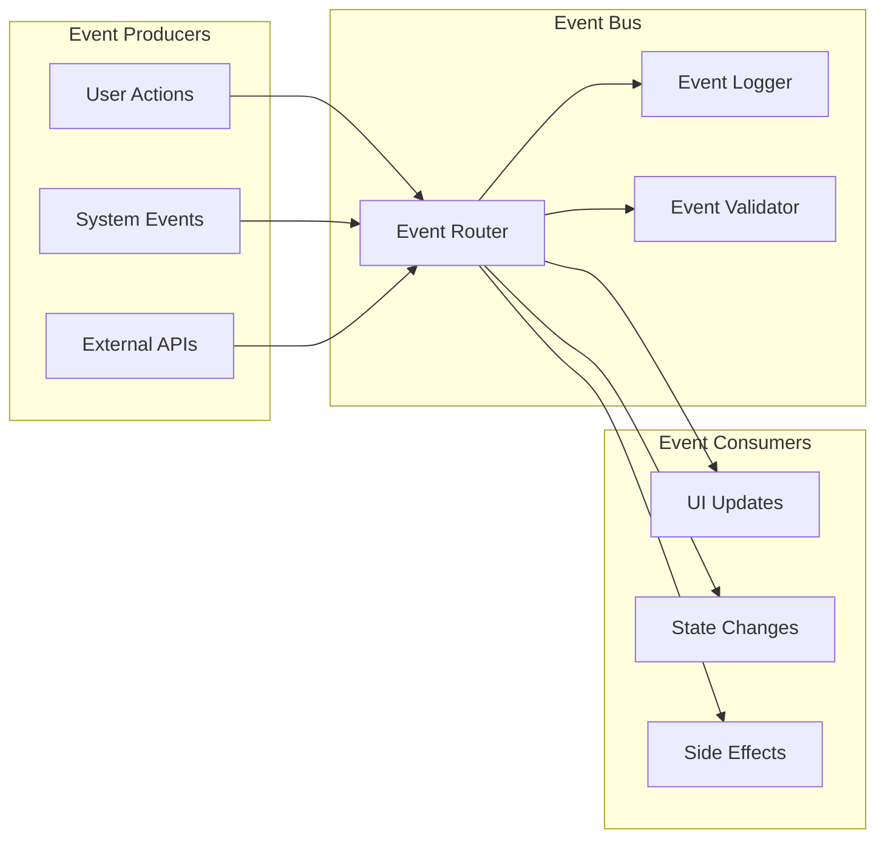

## 🚦 Tratamento de Erros

### Error Propagation Flow

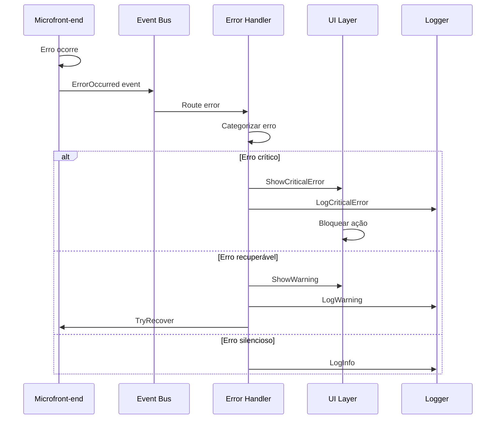

## 🔧 Debug e Monitoramento

### Event Flow Monitoring

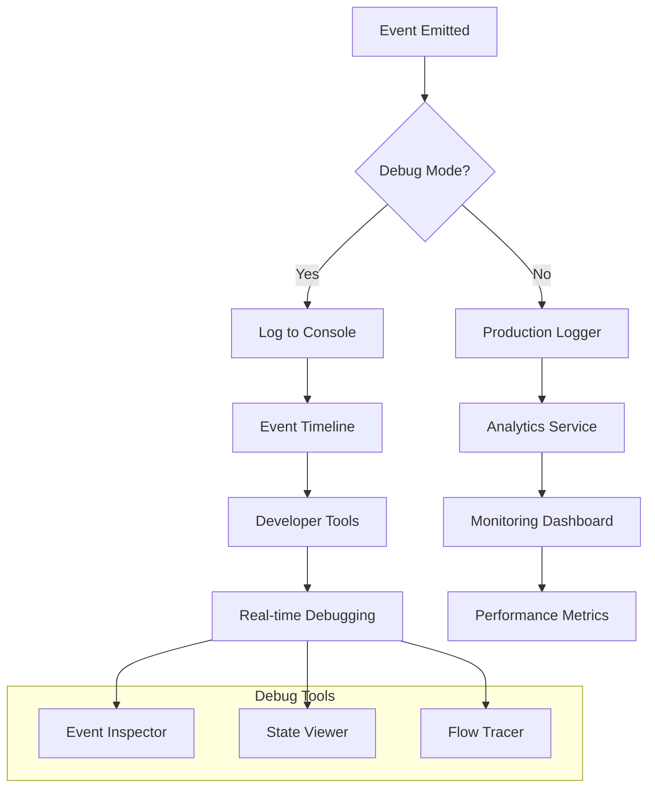

## 📊 Performance Considerations

### Event Bus Performance

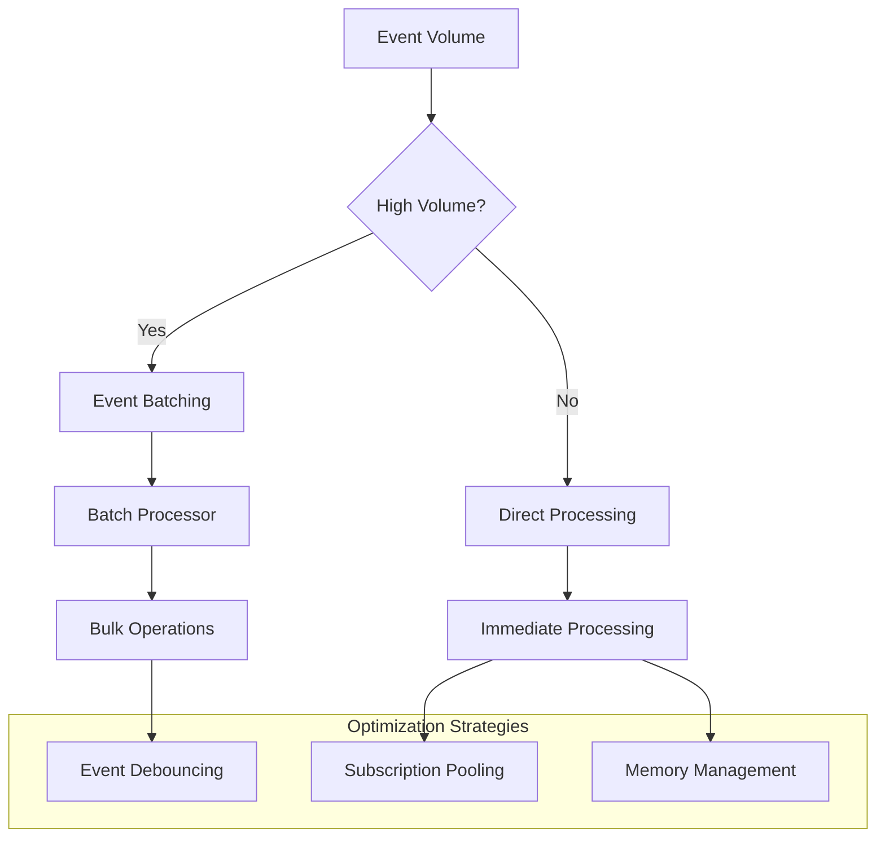

## 🔄 State Synchronization

### Cross-App State Sync

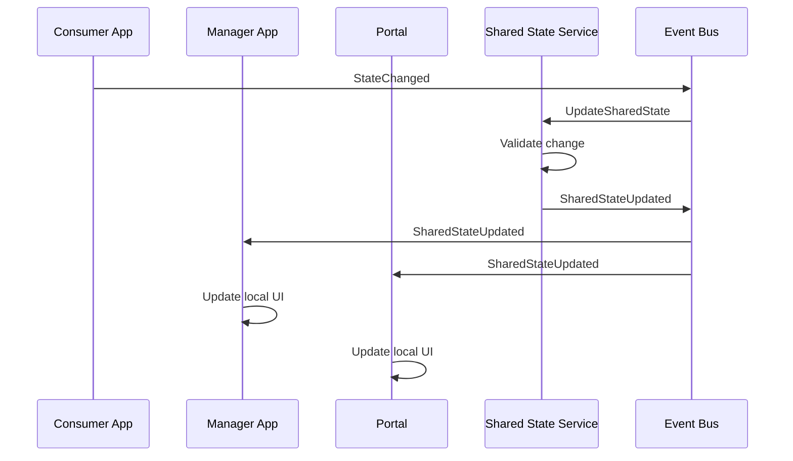

## 🎉 Conclusão

Os fluxos de comunicação entre microfront-ends seguem um padrão consistente baseado em eventos, garantindo baixo acoplamento e alta coesão. O Event Bus atua como o centralizador de comunicação, permitindo que cada microfront-end funcione independentemente while mantendo sincronização quando necessário.

### Benefícios dos Fluxos:
- **Desacoplamento**: Microfront-ends não conhecem uns aos outros diretamente
- **Escalabilidade**: Fácil adição de novos microfront-ends
- **Testabilidade**: Fluxos isolados são mais fáceis de testar
- **Debugging**: Event flow é rastreável e debugável
- **Reutilização**: Mesmos eventos funcionam em diferentes apps

### Próximos Passos:
1. Implementar Event Bus core
2. Definir contratos de eventos
3. Criar ferramentas de debug
4. Implementar monitoramento
5. Validar fluxos em ambiente de teste 