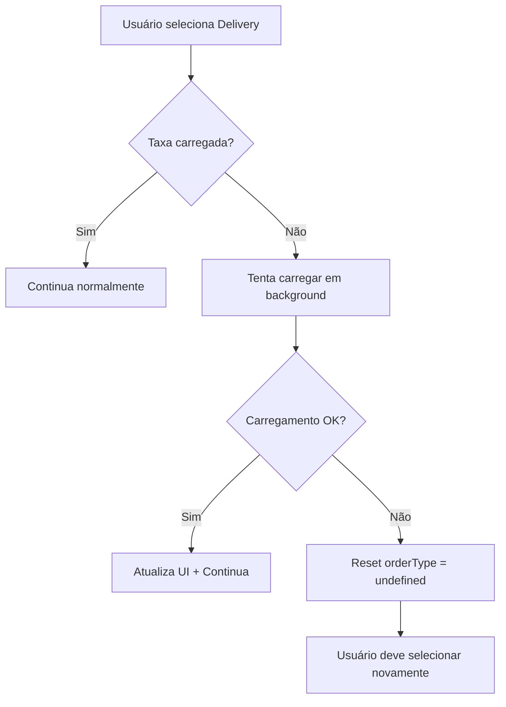

# Correções Críticas - Taxa de Entrega (v2.0)

## 🚨 Problema Identificado
Clientes relataram que alguns pedidos não estavam cobrando taxa de entrega, resultando em perda de receita e inconsistências no sistema.

## 🔧 Abordagem de Correção Revisada

### ❌ **Problema da Primeira Versão**
A implementação inicial com exceções estava travando a tela do usuário, prejudicando a experiência.

### ✅ **Nova Solução Robusta**
Implementação que **não quebra a UI** mas ainda resolve o problema:

## 🛡️ Soluções Implementadas

### 1. **Carregamento Automático da Taxa**
```dart
// Tenta carregar automaticamente em background
double get getDeliveryTax {
  if (deliveryTax == null) {
    _tryLoadDeliveryTaxInBackground(); // Não bloqueia UI
    return 0; // Retorna 0 temporariamente
  }
  return deliveryTax.price;
}
```

### 2. **Reset Inteligente do OrderType**
```dart
// Se falhar o carregamento, reseta para forçar nova seleção
void _resetOrderTypeToUndefined(String reason) {
  _orderType = OrderTypeEnum.undefined;
  deliveryAreaNotifier.clearDeliveryTaxCache();
  notifyListeners(); // Força usuário a selecionar novamente
}
```

### 3. **Tentativa de Recuperação no Save**
```dart
// Última chance de carregar taxa antes de salvar
if (deliveryAreaNotifier.deliveryTax == null) {
  try {
    await deliveryAreaNotifier.loadDeliveryTax(...);
  } catch (e) {
    throw Exception('Mensagem amigável para o usuário');
  }
}
```

### 4. **Validação Suave na UI**
```dart
// Não permite seleção sem taxa, mas não trava
if (menuViewmodel.deliveryAreaNotifier.deliveryTax == null) {
  context.push(Routes.searchAddress); // Redireciona gentilmente
  return;
}
```

## 🎯 **Fluxo de Recuperação Implementado**

### Cenário 1: Taxa não carregada
1. ✅ Tenta carregar automaticamente em background
2. ✅ Se conseguir: Atualiza UI e continua
3. ✅ Se falhar: Define orderType como `undefined`
4. ✅ Usuário é forçado a selecionar tipo novamente

### Cenário 2: Mudança de endereço
1. ✅ Cache é limpo automaticamente
2. ✅ Nova taxa é carregada para novo endereço
3. ✅ UI é atualizada automaticamente

### Cenário 3: Falha na API de taxa
1. ✅ Sistema tenta algumas vezes
2. ✅ Se falhar definitivamente: Reset para `undefined`
3. ✅ Usuário vê mensagem para verificar endereço

## 🔄 **Processo de Auto-Recuperação**



## 🛡️ **Camadas de Proteção (Revisadas)**

### Camada 1: **Prevenção Suave na UI**
- Redireciona para busca de endereço se necessário
- Não trava a interface

### Camada 2: **Auto-Recuperação no ViewModel**
- Tenta carregar taxa automaticamente
- Reseta orderType se falhar

### Camada 3: **Validação Inteligente**
- Mensagens amigáveis ao usuário
- Não bloqueia fluxo desnecessariamente

### Camada 4: **Última Tentativa no Save**
- Carregamento forçado antes de salvar
- Falha com mensagem clara se necessário

## ✅ **Vantagens da Nova Abordagem**

### ✅ **Não Quebra a UI**
- Zero travamentos de tela
- Experiência fluida para o usuário

### ✅ **Auto-Recuperação**
- Sistema tenta resolver sozinho
- Usuário só vê erro em casos extremos

### ✅ **Forçar Seleção Válida**
- OrderType undefined força nova escolha
- Garante que taxa sempre seja carregada

### ✅ **Logs Detalhados**
- Debug completo para desenvolvimento
- Rastreamento de problemas

## 🧪 **Casos de Teste**

### Teste 1: **Endereço válido**
- ✅ Taxa carregada automaticamente
- ✅ Pedido procede normalmente

### Teste 2: **Endereço inválido**
- ✅ OrderType vira undefined
- ✅ Usuário obrigado a escolher novamente

### Teste 3: **Falha de rede**
- ✅ Sistema tenta algumas vezes
- ✅ Fallback gracioso para undefined

### Teste 4: **Mudança de endereço**
- ✅ Cache limpo automaticamente
- ✅ Nova taxa carregada

## 📊 **Indicadores de Sucesso**

### ✅ **Zero travamentos de UI**
### ✅ **Taxa sempre validada antes do save**
### ✅ **Experiência suave para o usuário**
### ✅ **Logs detalhados para debug**

---

## 🚀 **Resultado Final**

O sistema agora:
- **Nunca trava a tela** do usuário
- **Sempre tenta carregar** a taxa automaticamente
- **Força seleção válida** quando há problemas
- **Mantém logs detalhados** para debug
- **Bloqueia pedidos inválidos** no último momento

**💡 ESSÊNCIA**: Abordagem "fail-safe" que prioriza experiência do usuário mas ainda garante integridade dos dados. 